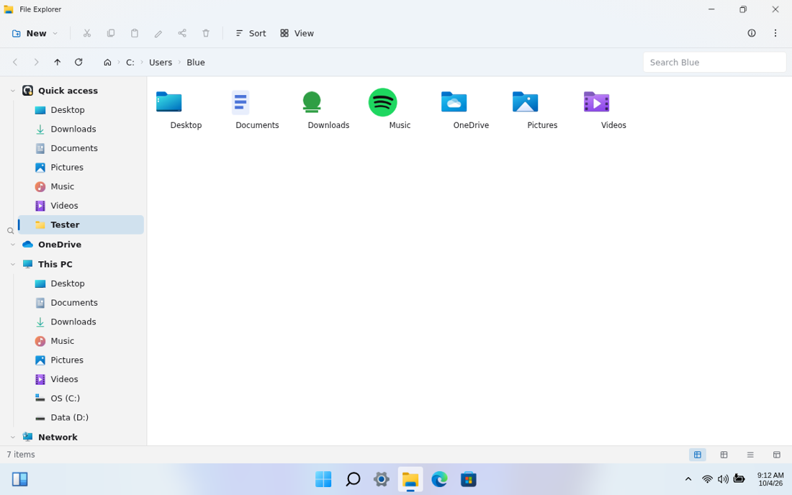
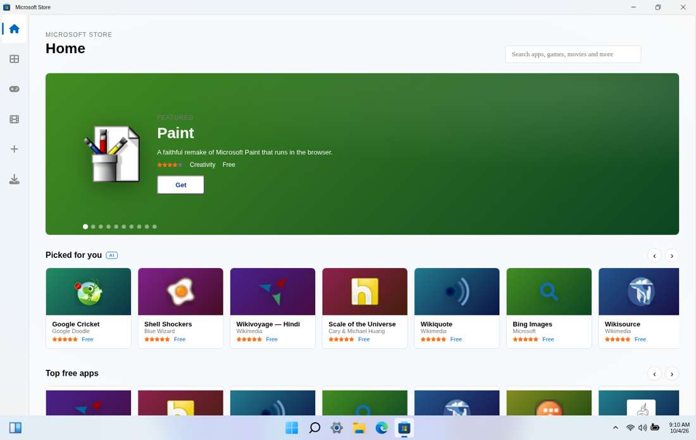

# WebOS 1.01

**Quality update · released 4 October 2026 · about 2.3 MB**

A fixes-only build. Nothing about the desktop moves, and everything you have
saved — files, apps, settings, wallpapers — stays exactly where it is.

## What is fixed

### Local pages in Edge really load now

Opening a saved `.html` file from File Explorer used to look broken: the page
rendered, but the progress bar never finished and Edge eventually replaced the
page with its "This page cannot be displayed" screen.

The cause was the browser asking a **web server** about a **local file**: a
`.html` document opened from this PC travels as a `blob:` address, and the
address was being sent to the page relay like any other URL. Nothing can answer
that request, so the failure was reported as a network error.

Edge now recognises every locally-made page (`blob:`, `data:`, `file:`,
`webos:`, `filesystem:`) and skips the relay entirely. The tab is titled after
the file, the address bar shows the file instead of a meaningless hash, and the
progress bar completes when the page is on screen. The padlock is hidden too,
because no connection was ever made.

### Keyboard shortcuts belong to the focused window

File Explorer listened for `Ctrl+V` on the whole page, no matter which window
you were typing in. Two things followed from that: pasting into Notepad did
nothing, and the same keystroke pasted a _file_ into whatever folder Explorer
last had open.

The keyboard now follows the front-most window, in Explorer and everywhere else
(Camera, Paint, Photos, Whiteboard, Notepad, the Store viewer). Notepad's menu
items and the real shortcuts are the same code path, so **Edit ▸ Paste** and
`Ctrl+V` can no longer disagree.

A second, quieter cause is fixed as well: Notepad wrote your typing into a tab
by its _position_. If two tabs pointed at the same file, or a restored session
reordered them, the keystroke went to the wrong document — or nowhere. Edits
now address the document by its own identity, and the active tab can never point
past the end of the list.

### Copying onto an existing name asks first

Pasting `report.html` into a folder that already had one silently produced
`report (2).html`. Windows asks. So does this one now, with the three real
choices: **Replace the files**, **Keep both copies**, or **Cancel**.

### Faster, quieter, more private

- Every Store app logo now ships with the PC (`app-logos/`). The Store used to
  fetch around 240 icons from other people's servers while you watched it
  load; it is one local request per icon now, and the Store works offline.
- The keyboard easter eggs (~220 KB) load after the desktop is up instead of
  holding up the first paint.

## What is new

- **Windows Update** is a real feature now: a window with the version, the kind
  of update (quality or feature), its size, the date and the release notes.
  It checks in the background shortly after boot and tells you once — it never
  nags.
- **Settings ▸ Windows Update** carries the same information, and the About
  panel names the build you are running: _WebOS 1 · v1.01 · Build 1_.
- **Library** in the Store lists what _you_ installed, with search, filters,
  install dates and an Uninstall button. The apps that came with WebOS are
  listed separately, because they are not downloads.
- **Add your own app** shows a live preview of the card and keeps a list of the
  apps you have added, so they can be removed again.
- The Store's featured row now rotates through ten apps, and the Start menu
  search ranks apps, settings pages and system actions together with
  highlighted matches.

## Known limitation

A site that refuses to be embedded still refuses: Microsoft Edge here has no way
around another site's own headers when the browser helper is not installed. Edge
says so in plain language and offers a reader snapshot instead of pretending.

---

_Version scheme: `WebOS <family>` is the release, `v1.xx` is a quality update
inside it, and a new family (`2.00`) is a feature release. This PC reports both._
